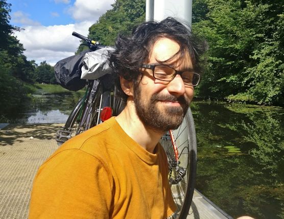

---
title: 0101chem — about
...

# 0101chem
<nav>
<a href="index.html"/>home</a>
</nav>

## What is 0101chem?
0101chem is the web presence for the outreach project *Digital Chemistry for Digital Natives*. The project is aimed at familiarizing high school students in Glasgow .... The ideal outcome is for students to leave with enough knowledge and confidence to envision their own integration of science and digital information.

## Why is it called 0101chem?
0101chem is a nod to how information has been embedded in chemistry since the beginning and how it is increasingly influencing chemistry's evolution.

We wanted to engage young minds in a discussion around science, specifically chemistry, and the information inherent in facets of it that we don't normally associate with computers. Computing has become a mainstay of everyday life, both in familiar forms like websites and mobile phone apps as well as less familiar ones like robotics, embedded devices, and artificial intelligence. 0101chem also explores how these myriad forms can empower chemists and broaden the types of questions that chemistry can aim to answer.

## Who is behind 0101chem?

### **Hessam Mehr** (Project lead) 
Hessam grew up in Iran, where he finished his BSc in Electrical Engineering and worked as a part-time high school chemistry teacher. In 2010 he left Tehran for Vancouver, Canada for a PhD in chemistry, which he spent building large self-assembling molecules in the laboratory of Prof. Mark MacLachlan. Hessam has always been fascinated by computers, chemistry, and languages. In 2018, he came to Glasgow to join the Digital Chemistry group in Glasgow University, where as a post-doctoral researcher he has been building robot chemists and systems to discover new molecules and chemical reactions without relying on human knowledge.

### **Naomi Johnson** (Scientific illustrator) 
Naomi combines her passion for drawing with her expertise in physical sciences by describing complex ideas through her illustrations. This is something she has been doing ever since she was at school (in Bristol, 2010), where she would often submit science homework in the form of a cartoon instead of an essay. This inclination to represent her thoughts visually proved particularly useful during her Chemistry PhD (in Glasgow, 2019) and she began to support and advise her colleagues on how to most effectively communicate their field of work. Naomi is dyslexic and therefore understands how much of a barrier can be created when concepts are explained using words alone. She believes it is very important to make STEM subjects accessible to a diverse range of people in order to push the boundaries of human knowledge.

### **Sophia Mallalieu** (School coordinator)
(Bio)

0101chem was made possible by the [RSC Outreach Fund] and the kind co-operation of [Whitehill Secondary School].

[RSC Outreach Fund]: https://www.rsc.org/prizes-funding/funding/outreach-fund/
[Whitehill Secondary School]: https://blogs.glowscotland.org.uk/gc/whitehillsecondary/