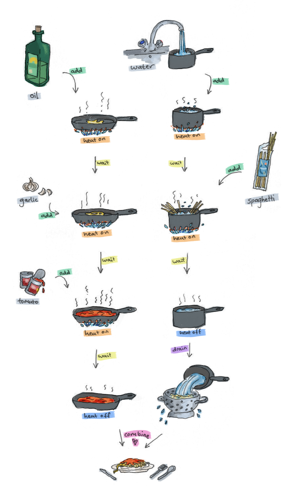

---
title: 0101chem
...

# 0101chem
<nav>
<a href="about.html"/>about</a>
</nav>

## A little introduction
<iframe src="https://docs.google.com/presentation/d/e/2PACX-1vRqGFXi8Jz3SgP2I6s1hvlzKI5Bun5ThEgrLvYRnseAnxaWH2s2QnpOKCBAo2IHn_EnXyY0DuzIWmXw/embed?start=false&loop=false&delayms=60000" class="slides" frameborder="0" allowfullscreen="true" mozallowfullscreen="true" webkitallowfullscreen="true"></iframe>

## Games, simulations, experiments
Scientific experiments look more serious and less fun than games. In reality, experiments and games both try to *simulate* <dfn def="Phenomena: Things that happen in the world around us.">phenomena</dfn>, so they are based on the same principles.

<iframe src="https://scratch.mit.edu/projects/508492898/embed" class="scratch" allowtransparency="true" width="485" height="402" frameborder="0" scrolling="no" allowfullscreen></iframe>
[Edit me][Maja]

## Instructions, recipes, code
There is a reason cooking takes years to master. A lot goes into making a delicious dish. Not only do you need to add the right ingredients and the right amount of each, the order in which you combine them also matters. When you teach a recipe to someone else, all these details needs to be communicated as well.

Chemicals and chemical reactions can be even more picky. Some compounds are quickly oxidized when exposed to oxygen in the air, for example, and some reactions only work within a precise temperature range. That's why chemical procedures are often more detailed than cooking recipes. Thankfully, computers are very good at following instructions exactly; they do exactly what they are told, no more and no less.

Just like we can use programming languages to write code that precisely communicates our intentions to the computer, we can do the same thing for chemistry: write chemical programs that a robot (or a human who doesn't know much about chemistry) can execute.

## Search, surprise, discovery
Many everyday situations require us to find a happy medium — turning the dials until everything is just right. Here is an example. Try seasoning a dish to perfection by finding the right amount of salt and pepper.

<iframe src="http://scratch.mit.edu/projects/530999790/embed" class="scratch" allowtransparency="true" width="485" height="402" frameborder="0" scrolling="no" allowfullscreen></iframe>
[Edit me][Seasoning]

A lot of science and engineering is also about searching for the best <dfn def="Parameters, variables (sometimes also called inputs): Things that we can choose, adjust or specify that will determine the outcome of an experiment or process.">parameters</dfn> in a given a problem.

- *When do we launch our rocket so it requires the least amount of fuel to reach the Mars?*
- *Who should get a new vaccine first in order to protect as many people as possible?* -
- *How much power should our new computer processor consume so it's as fast as possible without running out of battery quickly?*

[Maja]: https://scratch.mit.edu/projects/508492898/editor/
[Seasoning]: https://scratch.mit.edu/projects/530999790/editor/